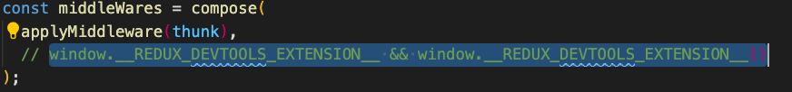

[Website link](https://rmr101.github.io/campus-frontend/)

## Content Table
- [About this project](#jr-academy-projects-3---campus-system-1.0)
- [How to use the website ?](#how-to-interact-with-the-project-?)
  - [Website access](#for-normal-interaction)
  - [Programmatic use (with docker)](#how-to-interact-with-this-app-with-no-docker-installed)
  - [Programmatic use (with no docker)](#how-to-interact-with-this-app-with-no-docker-installed)
  - Programmatic use (from docker hub)
## JR Academy Projects 3 - Campus system 1.0

This is project three from JR Academy. We are team RMR101. Objective of the project is to deliver a **learning management system** for an educational purpose.

**Features Summary:** 
- Adding teacher, students, courses as admin.
- Enrolling in various courses as student.
- Submitting and reviewing assignments as student. (Not support feature for public access, as AWS is involved, but can be configured.)
- Marking and creating assignment as teacher.
- 
**Tech stack for frontend Summary:**

Websites & UI:
- React
- Sass (module)
- React-redux
- React-router
- Axios

Testing:
- Jest & Jest-dom
- Testing library

Security:
- Jwt

Clouds:
- AWS S3
- AWS SDK

CI/CD:
- Travis CI
- Github page

Development:
- Agile (Scrumn)
- Github flow

Miscellaneous:
- Particle.js

For website, [Visited here](https://rmr101.github.io/campus-frontend/). However, you do need to run the backend for this website in order to interact with it. [Quick guide to set up backend of this project.](https://github.com/rmr101/campus-backend).

## How to interact with the project ?

### For normal interaction

This website is hosted at github page, all you need is to log in as admin account.

**Username: admin**
**Password: admin**

Then you can kick off from there.

How to access all feature please see here.

### How to interact with this app (with docker installed)

1. Set up Backend and docker container for MySql image. Click [here](https://github.com/rmr101/campus-backend) for the backend application.
2. Navigate to the file where you want to test this application, then on your terminal run `git clone https://github.com/rmr101/campus-frontend.git`
3. Change directory into `cd campus-frontend`.
2. Under to the root directory run `docker-compose up -d --build`.
3. Then visit `https://localhost:3010`.

## How to interact with this app (with no docker installed)
 
1. Set up Backend and docker container for MySql image. Click [here](https://github.com/rmr101/campus-backend) for the backend application.
2. Navigate to the file where you want to test this application, then on your terminal run `git clone https://github.com/rmr101/campus-frontend.git`
3. Change directory into `cd campus-frontend`.
4. run `npm install` or `yarn install`
5. `npm start` or `yarn start` , make sure you have set up the back end for this project.
6. This project also implement Redux Dev Tool extension on chrome. If haven't installed them [please check here.](#about-redux-dev-tool-in-this-project)

## UI Deisgn 

#### Energetic Login page

#### Choose your favorite avatar

#### View course details

Various panel according to your role

## Supported features

#### Teacher publish assignments.

#### Student can view the newest assignment, for every enrolled course.

#### Upon completion, student can upload their response. File is stored in AWS S3.

- Support file type: .pdf
- File size limit : Less than 25 MB.

#### After submission, teacher can download student response.

After reviewing, teacher can leave a report.

## User Management

#### Add/Update/Delete Students/Teachers/Assignments/Courses/

## About Redux dev tool in this project
This project have used redux dev tool. You may run into error, don't panic! so here is what you can do:

1. If you haven't already installed it for your browser, you could do so at this [link](https://chrome.google.com/webstore/detail/redux-devtools/lmhkpmbekcpmknklioeibfkpmmfibljd?hl=en)

2. Or you could comment out this dependency, under `src/store/index` comment out the following line of code like this,

   
#### Site Structure

- Student Profile:
	- Avatar
	- Name
	- Email
	- School
	- Mobile
	- City
	- Address
	- Enrollments
	- Assignments
  
- Course Profile:
	- Name
	- Course Code
	- Number of students
	- Prerequisite knowledge
	- Course length
	- City
	- Course objective
	- Level
	- CommenceDate
	- Start applied date
	- Complete date
	- Tuition
	- Teachers
	- Assignment
  
- Teacher Profile:
	- Name
	- Title
	- Avatar
	- Introduction
	- Course
	- Assignment
  
- Assignment Details
	- Name
	- Title
	- Content
	- Acceptance Criteria

#### Features

Only authenticated admin could manage all users, products, service .etc.

Teacher
- Manage assignments
- View students’ assignments
- Review students’ assignments

Student
- Enroll courses
- select avatar
- Payment
- View Class

Admin
- Register student/teacher
- CRUD course
- assign course
