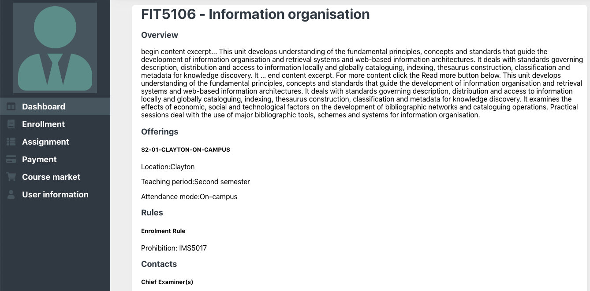
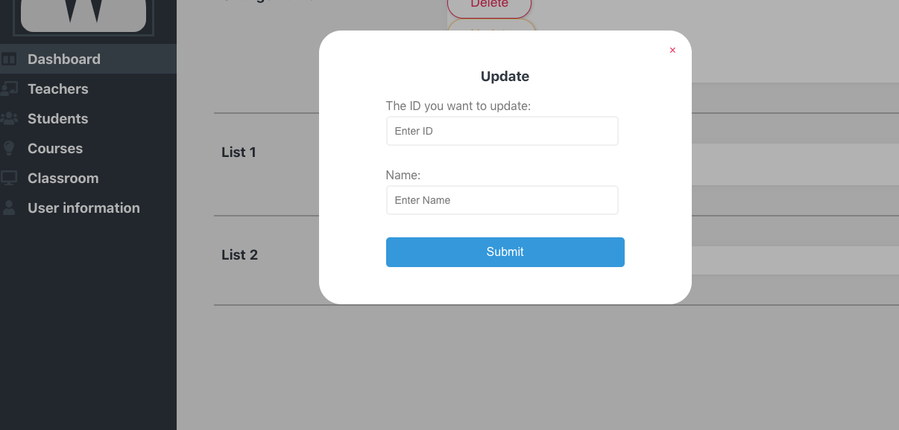

## JR Academy Projects 3 - Campus system 1.0 

This is project three from JR Academy. We are team RMR101.
Backend of this project can be found [here](https://github.com/rmr101/campus-backend).

## How to interact with this app.

1. Set up Backend and docker container for MySql image. Click [here](https://github.com/rmr101/campus-backend) for the backend application.
2. Navigate to the file where you want to test this application, then on your terminal run `git clone https://github.com/rmr101/campus-frontend.git`
3. Change directory into `cd campus-frontend`.
4. run `npm install` or `yarn install`
5. `npm start` or `yarn start` , make sure you have set up the back end for this project.
  

## About this Campus system.

**Objective:** Deliver a Learning management system which includes:
- Adding teacher, students, courses as admin.
- Enrolling in various courses as student.
- Submitting and reviewing assignments as student.
- Marking and creating assignment as teacher

#### UI Deisgn 

Energetic Login page

Choose your favorite avatar

View course details

Various panel according to your role

#### Supported features

### Assignment

Teacher publish assignments.

Student can view the newest assignment, for every enrolled course.

Upon completion, student can upload their response. File is stored in AWS S3.

- Support file type: .pdf
- File size limit : Less than 25 MB.

After submission, teacher can download student response.

After reviewing, teacher can leave a report.

### User Management
Add/Update/Delete Students/Teachers/Assignments/Courses/

#### Site Structure

- Student Profile:
	- Avatar
	- Name
	- Email
	- School
	- Mobile
	- City
	- Address
	- Enrollments
	- Assignments
  
- Course Profile:
	- Name
	- Course Code
	- Number of students
	- Prerequisite knowledge
	- Course length
	- City
	- Course objective
	- Level
	- CommenceDate
	- Start applied date
	- Complete date
	- Tuition
	- Teachers
	- Assignment
  
- Teacher Profile:
	- Name
	- Title
	- Avatar
	- Introduction
	- Course
	- Assignment
  
- Assignment Details
	- Name
	- Title
	- Content
	- Acceptance Criteria

#### Features

Only authenticated admin could manage all users, products, service .etc.

Teacher
- Manage assignments
- View students’ assignments
- Review students’ assignments

Student
- Enroll courses
- select avatar
- Payment
- View Class

Admin
- Register student/teacher
- CRUD course
- assign course